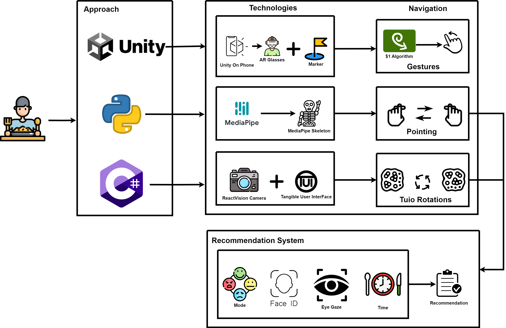
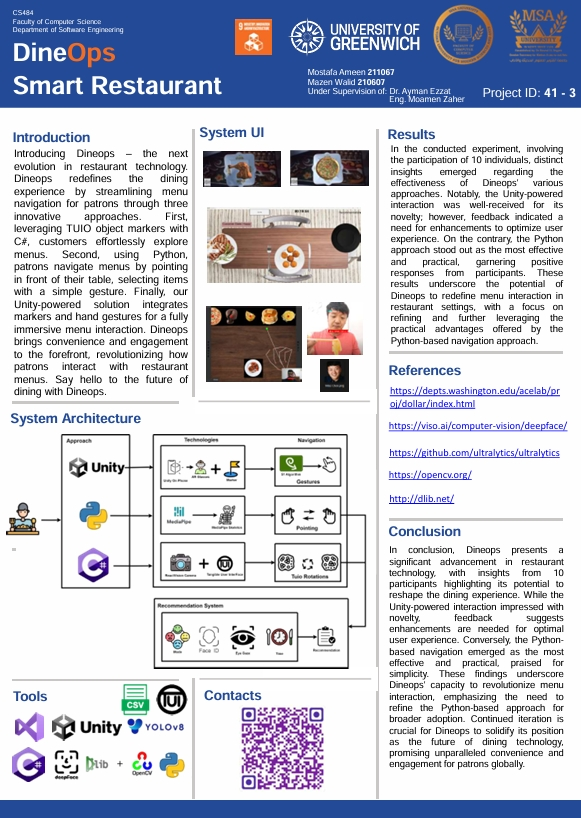

# DineOps - Smart Restaurant Technology (C# Version)

## Table of Contents
- [Overview](#overview)
- [System Architecture](#system-architecture)
- [Technologies and Tools](#technologies-and-tools)
- [Getting Started](#getting-started)
  - [Prerequisites](#prerequisites)
  - [Installation](#installation)
- [Usage](#usage)
- [Contributing](#contributing)
- [Contact](#contact)
- [Acknowledgment](#acknowledgment)

## Overview

**DineOps** is an innovative restaurant technology system developed as part of a Human-Computer Interaction (HCI) course at university. It aims to revolutionize the dining experience by providing streamlined and interactive menu navigation for patrons. This repository focuses on the TUIO Object Markers approach using C#.


## System Architecture



## Technologies and Tools

The C# TUIO-based navigation component utilizes the following technologies and tools:

- **C#**: Primary programming language for this component.
- **TUIO**: Protocol for tangible user interfaces, facilitating multi-touch interactive surfaces.
- **Windows Presentation Foundation (WPF)**: Used for creating the graphical user interface.
- **OpenCV**: Handles various computer vision tasks.
- **Emgu CV**: A .NET wrapper for OpenCV.

## Getting Started

### Prerequisites

To run the C# TUIO-based navigation component, you will need the following:

- Visual Studio 2019 or later
- .NET Framework 4.7.2 or later
- OpenCV
- Emgu CV

### Installation

1. Clone the repository:
   ```bash
   git clone https://github.com/mazen251/DineOps-C.git
   cd DineOps-C
   ```
2. Open the solution file (DineOps.sln) in Visual Studio.
3. Restore the NuGet packages:
   ```bash
   nuget restore
   ```
4. Build the solution to resolve any dependencies.

### Running the System

1. Connect a multi-touch surface or a compatible device.
2. Run the application from Visual Studio by pressing F5 or selecting Start Debugging from the menu.
3. The system will launch and enable interaction with the menu through TUIO object markers.

## File Descriptions

- **MainWindow.xaml.cs**: The main script that initializes the system, sets up the UI, and handles TUIO interactions.
- **TuioListener.cs**: Implements the TUIO listener interface to receive and process TUIO messages.
- **MenuNavigation.cs**: Manages the logic for navigating the menu based on TUIO marker interactions.
- **ObjectDetection.cs**: Uses OpenCV and Emgu CV for detecting and tracking object markers within the interactive surface.
- **Utils.cs**: Provides utility functions used across the system, such as image processing and data handling.

## System Poster

The system poster is available as a PDF in the gitAssets directory.


## Results

An experiment involving 10 participants provided valuable insights into the effectiveness of DineOps' TUIO-based approach:

- **TUIO-Based Interaction**: Praised for its intuitive and seamless integration with tangible user interfaces, enhancing the overall user experience.

These findings underscore the potential of DineOps to revolutionize menu interaction in restaurant settings, emphasizing the practical advantages of the TUIO-based navigation approach.

## Conclusion

DineOps represents a significant advancement in restaurant technology. Participant feedback highlights its potential to transform the dining experience:

- **TUIO-Based Interaction**: Proven to be intuitive and effective, highly appreciated for its seamless integration with tangible user interfaces.

Continuous improvement and iteration are essential for DineOps to establish itself as the future of dining technology, promising unparalleled convenience and engagement for patrons worldwide.


## Contact

For more information, contact:

Mazen Walid [@LinkedIn](https://www.linkedin.com/in/mazen-walid-225582208/)


## Acknowledgment

- [TUIO](http://www.tuio.org/)
- [OpenCV](https://opencv.org/)
- [Emgu CV](http://www.emgu.com/wiki/index.php/Main_Page)


